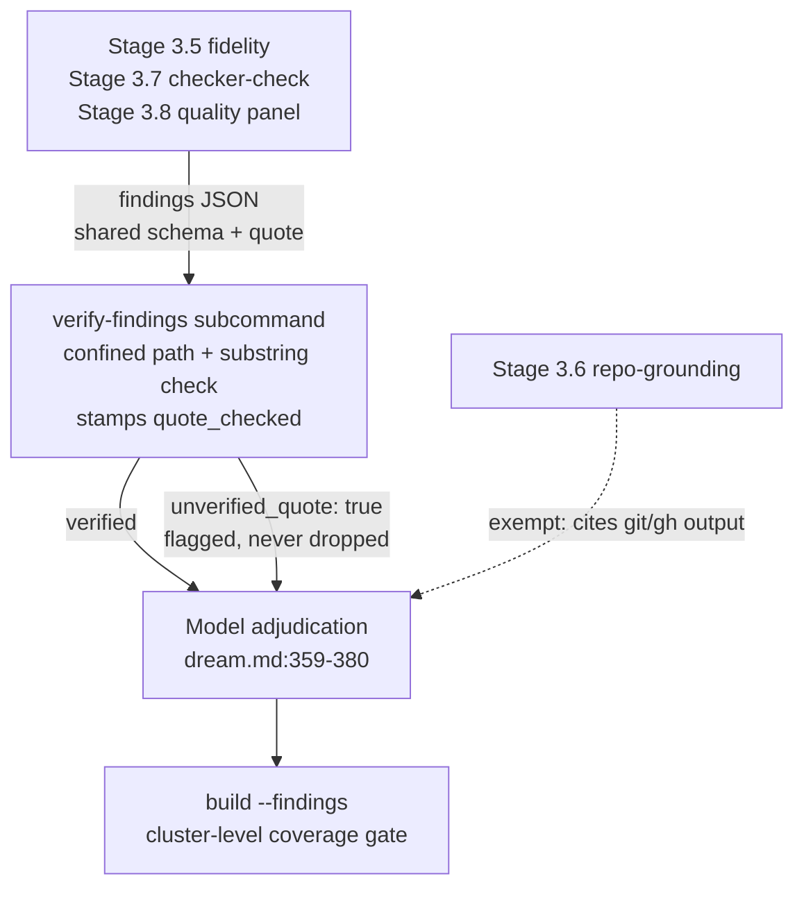
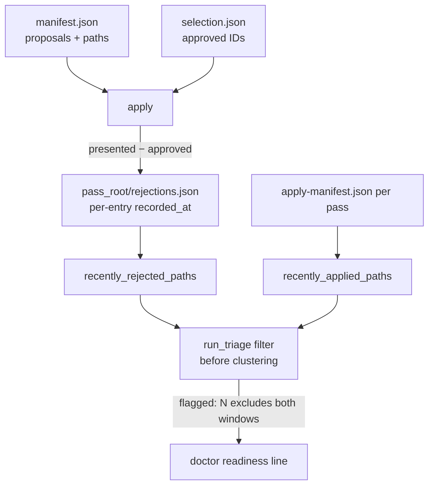

# Claims-Become-Checks Hardening - Plan

## Goal Capsule

- **Objective:** Every self-claim memory-dream makes — version-measured caps, consent-gate verification, panel quote checking, suppression memory, retention — is either enforced by code or visibly reported, so the operator learns about drift, fabrication, and accumulation from the tool rather than from the next incident.
- **Means:** Extend existing patterns (advisory doctor checks, the applied-suppression mechanism, the recall-eval substring check) across four components: a drift-honest doctor, a panel quote-existence gate, pipeline decision memory, and a read-only retention advisory (KTD1-KTD8).
- **Product authority:** This plan owns the four-component hardening pass. The other 2026-08-21 ideation survivors (Auto Dream positioning, review-attention tiering, sentinel recalibration) are not active scope.
- **Stop conditions:** Stop and surface if a change would alter doctor's default (flag-less) exit behavior, delete any file outside tool-owned scratch, or require a non-stdlib dependency.
- **Open blockers:** none.

**Product Contract preservation:** Product Contract preserved; one extension after document review: R3 gained an apply-time warning clause (warn-only, no exit-contract change).

---

## Product Contract

### Summary

Harden memory-dream so its self-claims are enforced or visible: a drift-honest doctor with one aggregate verdict, a code-level quote-existence gate on verification-panel findings, symmetric memory for rejected proposals plus repeat-deferral visibility, and a read-only retention advisory. Every addition is advisory; no new pipeline stages, no blocking behavior by default, no deletion code.

### Problem Frame

The repo asserts things its code does not enforce. The "measured against Claude Code v2.1.211" caveat is hand-synced across six files, and the doctor check meant to guard it passes a literal `True` (`memory_dream/cli.py:129-136`) — it structurally cannot fail. The consent gate depends on transcript flag keys that, if renamed upstream, would make a compaction turn read as a normal operator turn with no exception raised; the v0.2.1 incident (a compaction summary forging operator consent) came from exactly this class of silent host drift. `agents/scribe.md` claims "quote-existence checks on findings" that no code performs, while `docs/PROVENANCE.md` records a dated case (2026-07-20) of a panel quoting text that appeared in no file. The pipeline remembers approvals (`SUPPRESS_APPLIED_DAYS`) but not rejections, so a declined cluster is re-drafted and re-verified every pass, and deferred clusters surface only as counts — a cluster can lose the per-pass cap indefinitely without anyone seeing it. `PATCH_SET_RETENTION_DAYS` is documented as doing nothing on its own while patch-set copies of sensitive note content accumulate unbounded.

### Key Decisions

- **Retention is resolved read-only** — a doctor advisory, not a prune. (session-settled: user-directed — chosen over a cleanup command and deleting the knob: read-only keeps the never-deletes identity at the smallest diff.) Governs R12, R13, R14.
- **Full doctor package, not the minimal drift core.** (session-settled: user-directed — chosen over core-only variants: all parts are read-only, and the single aggregate line is the anti-noise discipline.) Governs R1-R7.
- **Advisory-first contract:** doctor's default (flag-less) exit-code behavior is unchanged; strictness is opt-in. Governs R6, R7.
- **Rejection memory mirrors the applied-suppression shape and includes its prerequisite:** no rejected-ID record exists today (verified — `selection.json` carries only `approved`, the apply manifest records only processed proposals), so recording rejections is part of the requirement, not an assumption. Governs R8, R9, R10.
- **The quote gate is the first programmatic consumer of panel findings** (verified — nothing parses the finding fields today, and the build-time coverage gate validates a separate schema), so the gate flags failures rather than discarding findings. Governs R15, R16, R17.

### Requirements

**Drift doctor**

- R1. One compatibility record owns the measured-host claim (measured Claude Code version plus the measured index-cap values); every site that states it today (`memory_dream/config.py`, `memory_dream/audit.py`, `memory_dream/cli.py`, `docs/TUNING.md`, `README.md`, `docs/EXTRACTION-DESIGN.md`) derives from or cites the record instead of hand-syncing the string.
- R2. Doctor compares the installed Claude Code version against the record and reports mismatch as a drift advisory; the index-cap check's result reflects this comparison instead of a constant pass.
- R3. Doctor verifies the consent-gate transcript flags: locate a compaction-shaped turn in a recent transcript and assert the expected flag keys are present; when no compaction sample exists, report "unverified — no compaction sample," never drift. Apply's preflight runs the same canary and prints a prominent warning when it reports drift, before the consent-trace check; no exit contract changes.
- R4. Doctor lists every config value that differs from its shipped default, naming the override source (env var or JSON config key).
- R5. Doctor surfaces the deterministic triage readiness count (flagged clusters), excluding clusters suppressed by either the applied or the rejected window.
- R6. A `--strict` flag makes doctor exit nonzero when any drift advisory fired; the default invocation's exit-code contract is unchanged.
- R7. Doctor output ends with one aggregate line stating whether anything drifted.

**Pipeline decision memory**

- R8. The selection/apply flow durably records which assembled proposals the operator did not approve.
- R9. Triage suppresses re-flagging clusters whose proposals were rejected within the suppression window, symmetric to the applied-side mechanism, and the suppression decays after the window.
- R10. Rejected-cluster identity survives note renames and merges well enough that an unchanged cluster is recognized across passes.
- R11. Pass reporting shows repeat-deferral identity — which clusters were deferred and for how many consecutive passes — from the per-item deferral data already persisted.

**Retention advisory**

- R12. Doctor reports patch-set directories older than `PATCH_SET_RETENTION_DAYS` (count and total size) using the existing advisory-check pattern.
- R13. Doctor checks the well-known preview-copy location (the same path computation `open-preview` uses) and reports a leftover copy.
- R14. The retention value's documentation names its consumer (the advisory), replacing "does nothing on its own."

**Panel quote gate**

- R15. Panel findings carry a machine-readable quoted span and source path alongside the existing fields.
- R16. Code verifies each finding's quoted span exists in its cited source before the finding reaches model adjudication; failures mark the finding unverifiable — visibly flagged, never dropped.
- R17. `agents/scribe.md` no longer claims a quote-existence check the code does not perform; after R16 the claim is true and cites the real mechanism.

### Key Flows

- F1. Post-upgrade drift check
  - **Trigger:** Operator upgrades Claude Code (or suspects drift) and runs doctor.
  - **Steps:** Doctor compares installed version to the compatibility record; runs the transcript-flag canary; lists non-default config; reports overdue patch sets and leftover preview copy; prints the aggregate verdict.
  - **Outcome:** Drift is visible in one run; `--strict` gives scripts a single exit code. **Covers R1-R7, R12, R13.**
- F2. Panel finding lifecycle
  - **Trigger:** A verification panel returns findings during a dream pass.
  - **Steps:** Each finding's quoted span is substring-checked against its cited source; verified findings proceed to model adjudication; failed findings are flagged unverifiable and shown with that label.
  - **Outcome:** A fabricated quote can no longer masquerade as evidence; the operator sees which findings earned trust. **Covers R15, R16.**
- F3. Rejection remembered across passes
  - **Trigger:** The operator declines a proposal during apply.
  - **Steps:** The rejection is recorded; the next pass's triage suppresses the cluster while the window holds; after decay, the cluster may be flagged again; the readiness count excludes suppressed clusters throughout.
  - **Outcome:** No re-drafting or re-verifying of a decision the operator already made, without making rejection permanent. **Covers R5, R8, R9.**

### Acceptance Examples

- AE1. **Covers R3, R6.** Given no compaction-shaped turn exists in recent transcripts, when doctor runs, then the canary reports "unverified — no compaction sample" and `--strict` still exits 0.
- AE2. **Covers R3, R6, R7.** Given a transcript where the consent-flag keys are renamed, when doctor runs, then the canary reports drift, the aggregate line says so, default exit stays 0, and `--strict` exits nonzero.
- AE3. **Covers R8, R9.** Given the operator rejected a cluster's proposal in pass N, when pass N+1 runs inside the suppression window, then the cluster is not re-flagged or re-drafted; when a pass runs after the window, it may be flagged again.
- AE4. **Covers R16.** Given a panel finding quoting text absent from its cited source, when the gate runs, then the finding is marked unverifiable and still displayed — never silently dropped.
- AE5. **Covers R4.** Given `MERGE_JACCARD` is overridden via env var, when doctor runs, then the value is listed as non-default with its env-var source.
- AE6. **Covers R12.** Given patch-set directories older than the retention window, when doctor runs, then their count and total size are reported and nothing is deleted.

### Success Criteria

- Every new advisory has a test that simulates its drift or failure condition — the checks are themselves checked.
- Existing doctor exit-code tests pass unchanged; a healthy layout produces the same default behavior as today.
- A clean dream pass requires no new operator action from any of this.

### Scope Boundaries

**Deferred for later**

- Auto Dream positioning rewrite, review-attention tiering (active-session warning fix, batch consent for the archive tier, preview rollup line), sentinel recalibration, and the generation counter — all remain candidates in `docs/ideation/2026-08-21-memory-dream-skill-ideation.html`.
- The `MIRROR_PUSH_HINT` placeholder papercut.

**Outside this product's identity**

- Any deletion or cleanup code; retention stays read-only per the Key Decision above.
- Any autonomy increase: no auto-apply, no scheduled passes, no blocking doctor behavior by default.

### Dependencies / Assumptions

- Doctor can determine the installed Claude Code version (CLI invocation or equivalent); when it cannot — absent binary, nonzero exit, unrecognized output, or timeout — the comparison reports "unverifiable," never drift.
- Patch sets live under the pass root (`memory_dream/config.py:119-122`); the advisory walks only that root.
- The preview copy lands at a deterministic path (`memory_dream/cli.py:193`); the advisory reuses that computation. Historical copies at other locations are not discoverable.
- Verified absences this plan builds on: no rejected-ID record exists (R8 creates it); no code parses panel finding fields (R16 is the first consumer).
- The canary's compaction-shape heuristic is the documented compaction boilerplate prefix pinned in the test fixtures; a simultaneous upstream rename of both flag keys and that boilerplate remains undetectable — an accepted residual gap in R3's coverage.
- Repeat-deferral counting keys per-pass-cap entries on the cluster's member path set, not `cluster_id` (the id hashes the member set and churns as membership changes); streak state persists in a durable sidecar outside `pass_root()` so acting on the retention advisory never resets deferral history.
- Non-approval equals rejection: the dream flow presents proposals once and applies the approved subset, so proposals presented but not approved are recorded as rejected. Deferred and manual-review items were never presented for approval and are not recorded.

### Outstanding Questions

**Deferred to implementation**

- The canary's transcript sampling bound (newest 5 files) is an unmeasured default — widen with a byte/line budget or measure compaction density before hardening the number.
- Where the per-stage finding JSON files persist for `verify-findings` to read (the only documented findings artifact today is the cluster-level rollup).
- Whether chronic quote-gate failures recurring across passes should ever feed doctor's `--strict` ledger, or stay per-run advisories.
- Whether `SUPPRESS_REJECTED_DAYS` and `SUPPRESS_APPLIED_DAYS` should share one operator-facing knob.

**Resolve Before Planning:** none — the four questions the requirements pass deferred are resolved in KTD1, KTD2, KTD4, and KTD5.

### Sources / Research

- `docs/ideation/2026-08-21-memory-dream-skill-ideation.html` — ideas 1-4 and their verified bases; the rejection table explains what was cut and why.
- Fresh-context verification (2026-08-21), key anchors: `memory_dream/cli.py:129-136` (always-True check), `memory_dream/transcript.py:77-113` (parse-only probe; silent-failure mode if flag keys rename), `memory_dream/apply.py:672` (approved-only selection), `memory_dream/assemble.py:885-964` (coverage gate does not bind the finding schema), `memory_dream/audit.py:717-826` (applied-suppression mechanism), `memory_dream/cli.py:153-209` (open-preview platform branches and preview path).
- Planning research (2026-08-21): `templates/` holds only `fidelity-prompt.md` and `routing-prompts.json`; checker-check and quality-panel stages are prose-only in `commands/dream.md:345-380` with a cluster-level rollup at `:412-413`; `run_triage` supports `--format json` and its `flagged:` line is a documented external grep contract (`memory_dream/audit.py:829-833`); `cluster_id` hashes the member-path set (`memory_dream/assemble.py:34-43,112`); config overrides mutate module globals in place with `_OVERRIDABLE` built at import time (`memory_dream/config.py:78-82,157-201`); doctor tests run the CLI as a subprocess with a temp `claude-config` fixture (`tests/test_extraction_surfaces.py:50-60,503-547`).
- Document review (2026-08-21, five personas): P1 corrections integrated — path-keyed repeat-deferral identity, defined compaction-shape heuristic, `compute_triage` extraction, apply-time canary warning, confined-path resolution in the quote gate, `quote_checked` stamping.
- `docs/PROVENANCE.md` (panel false positives, 2026-07-20) and `CHANGELOG.md` v0.2.1 (compaction-summary consent forgery) — the incident record motivating R3 and R16.
- `memory_dream/recall_eval.py:183` — the existing substring-check precedent R16 replicates.

---

## Planning Contract

### Key Technical Decisions

- KTD1. **Compatibility record is a module constant in `memory_dream/config.py`** (a small mapping: measured Claude Code version + measured index-cap values). Code sites read it; doc sites (`README.md`, `docs/TUNING.md`, `docs/EXTRACTION-DESIGN.md`) cite the constant by name instead of restating the version literal, leaving exactly one literal in the repo. Rationale: stdlib-only, no data file, greppable. Covers R1.
- KTD2. **Installed-version detection shells out to the `claude` CLI** (`shutil.which` + `--version`) with an explicit subprocess timeout mirroring the timeout pattern `cli.py`'s preview-opener subprocess calls already use, parsing best-effort. Absent binary, nonzero exit, unrecognized output, or timeout all degrade to "unverifiable — could not determine installed version," never drift and never a hang. Covers R2.
- KTD3. **The compaction canary samples the newest 5 transcript files** for a compaction-shaped turn and asserts the consent-flag keys on it. Compaction-shaped means: an entry carrying either consent-flag key, or matching the documented compaction boilerplate prefix (the shape pinned by the tests' compaction-turn fixture). A shape-matched turn missing the flag keys is drift; no compaction sample at all is "unverified," never drift (per R3). Apply's preflight reuses the same probe to print its warn-only notice (R3). The 5-file bound is an unmeasured default (see Outstanding Questions).
- KTD4. **The rejection record is `rejections.json` directly under `pass_root()`** — a sibling of the dated pass directories, not inside one, so acting on the retention advisory (R12) can never erase active suppression. Append-shaped entries: `{recorded_at, patch_set_id, proposal_id, project, paths[]}` where `paths` is the rejected proposal's own sources ∪ results. Written by apply: rejected = proposals presented for approval − approved (see Assumptions). Readers filter by per-entry `recorded_at`; nothing prunes the file. Covers R8.
- KTD5. **Rejection suppression is path-based, per-proposal, inside `run_triage`** — a `recently_rejected_paths()` mirror of `recently_applied_paths()` (`memory_dream/audit.py:717-750`) reading `rejections.json`, filtering flagged records before clustering exactly like the applied-side filter (`audit.py:789-805`). Per-proposal scope means an approved sibling proposal's paths are never suppressed. A new `SUPPRESS_REJECTED_DAYS` constant (default 14, independently overridable) sets the window. Asymmetry note: unlike the applied side, whose suppressed paths the operator actually reviewed and rewrote, the rejected side's path list is model-drafted proposal scope — the operator declined the proposal, not necessarily each path in it. The window is deliberately short and independently tunable for that reason. Path matching gives the same rename fidelity as the applied side, which satisfies R10: an unchanged cluster has unchanged paths. Landing inside `run_triage` keeps the greppable `flagged:` contract single-sourced; doctor reuses the triage code path rather than reimplementing the count (R5). Covers R9, R10, and the counting side of R5.
- KTD6. **The quote gate is a new advisory subcommand (`verify-findings`)** invoked by the `commands/dream.md` flow after each finding-producing verification stage (fidelity 3.5, checker-check 3.7, quality panel 3.8) and before model adjudication (`dream.md:359-380`). One shared per-finding schema — the fidelity schema plus a `quote` field — is defined once and adopted by all three stages (3.7 and 3.8 have no schema today; this creates theirs). Repo-grounding (3.6) is exempt: its findings verify against `git`/`gh` output, where a file-substring check is a category error. The subcommand confines every finding's cited path with the existing confined-path helper (the same one `recall_eval.py`'s check relies on) against its base before opening any file — an escaping or unresolvable path is stamped unverifiable, never read. It substring-checks each `quote` against the finding's cited path (the `memory_dream/recall_eval.py:183` pattern), and stamps **every** finding it processes with an explicit `quote_checked: true/false` — distinct from field absence — so a finding whose stage skipped the gate is distinguishable from one that passed; the adjudication instructions treat findings without the stamp as unverifiable, same lane as `unverified_quote`. Always exits 0. `run_build`'s coverage gate is not the hook — it runs after adjudication and never sees findings. Covers R15, R16.
- KTD7. **`--strict` recomputes exit from recorded drift advisories only.** Checks that report "unverifiable," "unverified — no sample," or nothing-found (missing `pass_root()`, missing transcripts, fresh checkout) are not drift and never fail `--strict`. Default (flag-less) exit semantics stay byte-identical to today's tested contract. Covers R6 and the strict half of AE1/AE2.
- KTD8. **Non-default config detection snapshots `_DEFAULTS` at import time**, mirroring how `_OVERRIDABLE` is built (`memory_dream/config.py:78-82`) before any override applies; source attribution checks the env var first, then the JSON file key. Covers R4.

### High-Level Technical Design

Directional guidance, not implementation specification.

Finding lifecycle with the new gate (F2):

Decision-memory data flow (F3, R5):

---

## Implementation Units

### U1. Compatibility record and live version check

- **Goal:** One source of truth for the measured-host claim; doctor's index-cap check becomes a real comparison.
- **Requirements:** R1, R2. Cites KTD1, KTD2.
- **Dependencies:** none.
- **Files:** `memory_dream/config.py`, `memory_dream/cli.py`, `memory_dream/audit.py` (docstring cite at `:656`), `README.md:74`, `docs/TUNING.md:23,53`, `docs/EXTRACTION-DESIGN.md:86`, `tests/test_extraction_surfaces.py`.
- **Approach:**
  1. Add the compatibility-record constant to `config.py` (KTD1).
  2. Replace the literal `True` check (`cli.py:129-136`) with: detect installed version (KTD2, with subprocess timeout), compare against the record, emit ok/drift/unverifiable detail.
  3. Rewrite the six prose sites to cite the constant by name; delete every other `v2.1.211` literal.
- **Patterns to follow:** existing `(label, ok, detail, fatal)` check tuples, the `shutil.which` probe pattern, and the subprocess timeout values already used in `_run_open_preview`.
- **Test scenarios:**
  - Installed version equals record → check ok, detail names both.
  - Installed version differs → check not-ok (advisory), detail names both versions.
  - `claude` binary absent → "unverifiable," check stays advisory-ok for default exit.
  - `claude --version` returns garbage → "unverifiable," no exception.
  - `claude --version` hangs past the timeout → "unverifiable," doctor returns promptly.
  - Grep test: `v2.1.211` appears in exactly one file (`memory_dream/config.py`).
- **Verification:** doctor subprocess tests pass with the temp `claude-config` fixture; existing `test_healthy_layout_exits_zero` unchanged.

### U2. Compaction canary

- **Goal:** Doctor and apply both surface consent-gate drift against real transcripts, catching the silent-rename failure mode where it matters.
- **Requirements:** R3. Cites KTD3.
- **Dependencies:** none.
- **Files:** `memory_dream/transcript.py`, `memory_dream/cli.py`, `memory_dream/apply.py` (preflight warning), `tests/test_trace.py` or `tests/test_extraction_surfaces.py`.
- **Approach:**
  1. New probe in `transcript.py`: scan the newest 5 `*.jsonl` files for a compaction-shaped turn — an entry carrying either consent-flag key, or matching the compaction boilerplate prefix the test fixture pins (KTD3). Return verified / drift (shape-matched turn without the expected keys) / unverified (no sample).
  2. Wire as a doctor advisory check.
  3. Apply preflight: call the same probe before the consent-trace check; on drift, print a prominent warn-only notice (R3); no exit-code or gating change.
- **Execution note:** Write the failing test first with a fixture transcript whose flag keys are renamed — the exact v0.2.1 incident shape.
- **Test scenarios:**
  - Fixture transcript with a normal compaction turn → verified.
  - Fixture with renamed flag keys on a boilerplate-shaped turn → drift reported. Covers AE2.
  - No compaction turn in any sampled file → "unverified — no compaction sample." Covers AE1.
  - Empty or missing transcript dir → unverified, no exception.
  - Apply preflight with the drift fixture → warning printed before the consent-trace step; apply behavior otherwise unchanged.
- **Verification:** canary line appears in doctor output via `_doctor_line`; default exit unchanged in all scenarios; apply's exit codes unchanged.

### U3. Non-default config listing

- **Goal:** Doctor lists every overridden config value with its source.
- **Requirements:** R4. Cites KTD8.
- **Dependencies:** none.
- **Files:** `memory_dream/config.py`, `memory_dream/cli.py`, `tests/test_extraction_surfaces.py`.
- **Approach:** Capture `_DEFAULTS` at import time next to `_OVERRIDABLE` (`config.py:78-82`); doctor compares live globals against it and attributes source (env prefix first, then JSON key).
- **Test scenarios:**
  - No overrides → line reports all-default. Baseline.
  - Env override set in subprocess env → listed with env-var source. Covers AE5.
  - JSON config override → listed with file source.
  - Env and JSON both set for one name → env wins and is named as source (matches resolution order).
- **Verification:** doctor subprocess test with `MEMORY_DREAM_*` env injection shows the override line.

### U4. Retention advisory

- **Goal:** The retention window becomes real information: overdue patch sets and leftover preview copies are visible, nothing is deleted.
- **Requirements:** R12, R13, R14. Cites the session-settled retention Key Decision.
- **Dependencies:** none.
- **Files:** `memory_dream/cli.py`, `docs/TUNING.md:83`, `tests/test_extraction_surfaces.py`.
- **Approach:**
  1. Doctor check walks `pass_root()` for dated pass dirs older than `PATCH_SET_RETENTION_DAYS` (dir mtime), reporting count and total size — same shape as the crash-leftover advisory (`cli.py:121-124`).
  2. Extract `open-preview`'s Windows-home resolution (`cli.py:181-193`) into a helper; the check stats `<home>/memory-dream-preview.html` on the WSL branch only.
  3. Rewrite the `PATCH_SET_RETENTION_DAYS` row in `docs/TUNING.md` (R14): the doctor advisory is now the consumer.
- **Test scenarios:**
  - Pass dirs older than the window → count and size reported; dirs still exist afterward. Covers AE6.
  - No pass root / empty root → clean, no advisory.
  - Missing `PATCH_SET_RETENTION_DAYS` override → default 90 applies.
  - Non-WSL platform → preview-copy check reports nothing (absence of `/mnt/c/Users`).
- **Verification:** doctor output shows the advisory; nothing under `pass_root()` is modified (assert dir listing unchanged).

### U6. Rejection recording

- **Goal:** What the operator declined is durably recorded, safe from patch-set pruning.
- **Requirements:** R8. Cites KTD4.
- **Dependencies:** none.
- **Files:** `memory_dream/apply.py`, `commands/dream.md` (document the record beside the `selection.json` schema at `:533-535`), `tests/test_apply.py` or the existing apply test module.
- **Approach:** At apply time, compute rejected = proposals presented for approval − approved (KTD4, Assumptions); join rejected IDs back to `manifest.json` proposals for their `(project, path)` tuples (sources ∪ results); append entries to `pass_root()/rejections.json` with `recorded_at`. Create the file on first write; malformed existing content is renamed aside, never silently overwritten.
- **Test scenarios:**
  - Apply with 3 presented, 2 approved → 1 rejection entry with that proposal's paths and a fresh `recorded_at`.
  - Apply with all approved → no new entries; file untouched or still absent.
  - Two applies appending → both entries present, order preserved.
  - Deferred/manual-review items → never recorded as rejections.
  - Corrupt `rejections.json` on disk → renamed aside, new record written, apply does not fail.
- **Verification:** file lands under `pass_root()` as a sibling of pass dirs (not inside one); apply-manifest content unchanged.

### U7. Rejected suppression and repeat-deferral visibility

- **Goal:** Triage stops re-flagging what the operator declined, and chronic deferral becomes visible — with history that survives retention pruning.
- **Requirements:** R5 (exclusion half), R9, R10, R11. Cites KTD5.
- **Dependencies:** U6.
- **Files:** `memory_dream/audit.py`, `memory_dream/config.py` (`SUPPRESS_REJECTED_DAYS`), `commands/dream.md` (report step mentions repeat-deferral output), `tests/test_audit.py`.
- **Approach:**
  1. `recently_rejected_paths()` mirroring `recently_applied_paths()` (`audit.py:717-750`): read `rejections.json`, filter entries by `recorded_at` within `SUPPRESS_REJECTED_DAYS`, return the path set.
  2. Apply it in `run_triage` beside the applied filter (`audit.py:789-805`); extend the summary with a rejected-suppression count so the JSON output distinguishes the two windows.
  3. Repeat-deferral: maintain a small durable streak file outside `pass_root()`'s dated dirs (sibling, like `rejections.json`), updated incrementally each pass from `report.json`'s deferred entries. Key per-pass-cap entries on the cluster's member path set (not `cluster_id`, which hashes membership and churns as clusters grow or renames land — mirroring the path-based identity KTD5 chose); key cluster-size-cap entries on `(project, path)`. Surface a repeat-deferral section in triage output (human and JSON). Pruning old patch sets never resets a streak.
- **Test scenarios:**
  - Rejection recorded yesterday, window 14 → paths suppressed; `flagged:` count excludes them. Covers AE3's first clause.
  - Rejection recorded 20 days ago → not suppressed. Covers AE3's decay clause.
  - Same path both recently-applied and recently-rejected → suppressed once, no double-count.
  - Cluster deferred in 3 consecutive passes → repeat-deferral output names it with count 3; a pass without it resets the count.
  - Cluster grows by one member between passes → streak continues (path-set key overlap rule), not reset by a changed `cluster_id`.
  - Deleting old pass dirs → streak file unaffected; counts preserved.
  - No `rejections.json` → triage behaves exactly as today.
- **Verification:** `flagged:` line format unchanged (documented grep contract, `audit.py:829-833`); existing triage tests pass unmodified.

### U5. Doctor aggregate, readiness line, and --strict

- **Goal:** One aggregate drift verdict, the readiness count surfaced, and a script-usable strict exit — with the default contract untouched.
- **Requirements:** R5 (surfacing half), R6, R7. Cites KTD5 (count source), KTD7.
- **Dependencies:** U1, U2, U3, U4 (their checks feed the aggregate); U7 (rejected-window exclusion in the count).
- **Files:** `memory_dream/cli.py`, `memory_dream/audit.py` (extract `compute_triage`), `tests/test_extraction_surfaces.py`, `tests/test_audit.py`.
- **Approach:**
  1. Split `run_triage` into a `compute_triage(...) -> dict` helper plus the existing print/exit wrapper, matching the return-value convention doctor already uses for `transcript.schema_probe()` — `run_triage` today only prints and returns an exit code, so in-process reuse requires this extraction.
  2. Tag each new check's outcome as drift / clean / unverifiable when appending it; the aggregate line summarizes tagged drift. `--strict` exits nonzero iff any drift tag exists (KTD7).
  3. The readiness line calls `compute_triage` (post-U7, both suppression windows applied) rather than recomputing.
- **Test scenarios:**
  - No drift anywhere → aggregate says clean; `--strict` exits 0.
  - One drift advisory (version mismatch fixture) → aggregate names it; default exit 0; `--strict` exits 1. Covers AE2's exit clauses.
  - Unverifiable-only outcomes (no `claude` binary, no transcripts) → aggregate reports unverified items; `--strict` exits 0. Covers AE1's strict clause and KTD7.
  - Fresh checkout (no pass root, no transcripts) with `--strict` → exit 0.
  - `compute_triage` returns the same summary dict the CLI path prints (parity test).
  - Existing tests `test_healthy_layout_exits_zero` / `test_missing_live_root_exits_one` pass unmodified.
- **Verification:** full doctor test class green; grep the two pinned default-exit tests for zero edits.

### U8. Quote-existence gate and doc truth-up

- **Goal:** A fabricated panel quote is caught by code before adjudication, and the docs stop claiming a check that does not exist.
- **Requirements:** R15, R16, R17. Cites KTD6.
- **Dependencies:** none.
- **Files:** `memory_dream/` (new `verify_findings` module or a verb in an existing module), `memory_dream/cli.py` (subcommand wiring), `templates/fidelity-prompt.md`, `commands/dream.md` (shared schema for stages 3.7/3.8; gate invocation before adjudication at `:359-380`; 3.6 exemption), `agents/scribe.md:24-25`, tests (new module).
- **Approach:**
  1. Add the `quote` field to the fidelity finding schema; state the shared schema once in `dream.md` for checker-check and quality panel (KTD6 — these stages gain their first schema).
  2. New advisory subcommand: input findings JSON path(s) + the base root(s) for resolving cited paths. Confine every cited path with the existing confined-path helper before any read (KTD6); escaping or unresolvable paths are stamped unverifiable without being opened. Substring-check each finding's `quote` against its source (normalize whitespace the way `recall_eval.py:183` does). Stamp every processed finding `quote_checked: true/false` plus `unverified_quote` where the check failed; write the findings back; exit 0 always.
  3. `dream.md`: invoke the gate after stages 3.5/3.7/3.8, before adjudication; adjudication instructions treat `unverified_quote` findings — and findings lacking the `quote_checked` stamp entirely (a stage that skipped the gate) — as unverifiable, never silently dropped.
  4. Fix `agents/scribe.md:24-25` to describe the real mechanism (R17).
- **Execution note:** Start with a failing test reproducing the 2026-07-20 shape: a finding quoting text absent from every file.
- **Test scenarios:**
  - Finding with a quote present in its cited file → `quote_checked: true`, no failure stamp. Happy path.
  - Finding quoting absent text → stamped `unverified_quote: true`, finding still present in output. Covers AE4.
  - Finding citing a nonexistent path → stamped unverifiable, no exception.
  - Finding citing a path that escapes the base root → stamped unverifiable, file never opened.
  - Finding with no `quote` field (legacy shape) → stamped unverifiable-no-quote, not dropped.
  - Whitespace-differing quote → normalized match succeeds (mirror `recall_eval.py` normalization).
  - Subcommand exit code is 0 in every scenario above.
- **Verification:** grep `agents/scribe.md` for the corrected claim; gate invocation present in `dream.md` for exactly stages 3.5/3.7/3.8; adjudication text covers the missing-stamp lane.

---

## Verification Contract

| Gate | Command | Applies to |
|---|---|---|
| Full test suite | `python -m unittest discover -s tests -v` | every unit; matches CI (`.github/workflows/test.yml:36`) |
| Stdlib-only guard | `python3 scripts/check_stdlib_only.py` | U1-U8 (any `memory_dream/` change) |
| Private-refs guard | `python3 scripts/check_no_private_refs.py` | any doc or code change |
| Default-exit pin | `test_healthy_layout_exits_zero` / `test_missing_live_root_exits_one` pass unmodified | U1-U5 |
| Contract greps | `v2.1.211` in exactly one file; `flagged:` line shape unchanged | U1, U7 |

CI runs the suite on ubuntu/macos/windows × Python 3.10/3.12 — new tests must avoid platform-specific paths except where the behavior is platform-gated (U4's WSL branch: skip or simulate via the `/mnt/c/Users` gate).

## Definition of Done

- All eight units complete; every R1-R17 is implemented or covered by a cited unit; AE1-AE6 each map to at least one passing test.
- Full suite green on the local platform; both guard scripts pass; the two default-exit tests are byte-unchanged.
- Docs updated: `docs/TUNING.md` retention row (R14), the six version-literal sites citing the record (R1), `agents/scribe.md` truth-up (R17), `commands/dream.md` schema + gate + rejection-record documentation.
- No abandoned or experimental code in the diff; no new runtime dependency; no deletion behavior anywhere.
- Doctor's default invocation on a healthy layout produces the same exit code and no new blocking behavior.
